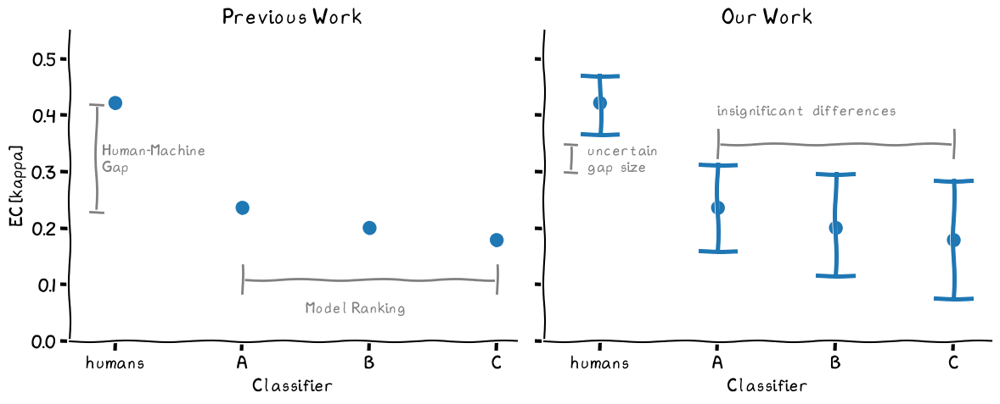

[](https://pycqa.github.io/isort/)
[](https://github.com/psf/black)


<p align="center">
  <a href="https://arxiv.org/abs/2507.06645">Paper</a> •
  <a href="#requirements">Requirements</a> •
  <a href="#contributing">Contributing</a> •
  <a href="#citation">Citation</a>
</p>

# Quantifying Uncertainty in Error Consistency: Towards Reliable Behavioral Comparison of Classifiers



We show how to compute confidence intervals for the Error Consistency metric, which measures whether two classifiers make errors on the same samples. It has also been used to quantify the behavioral alignment between humans and DNN models of vision. Here, we introduce a new computational model of EC that phrases the metric in terms of the probability that one observer copies responses from the other. We revisit older results and find that model rankings based on the existing data are unreliable.

This repo contains code to compute confidence intervals for EC, conduct significance tests and plan sufficiently powerful experiments.

# Requirements

This repo assumes a python version of at least 3.13. All other requirements are listed in `requirements.txt` and can just be pip-installed.


# Contributing

## Code Style

We use [Black](https://github.com/psf/black) and [isort](https://github.com/PyCQA/isort) for code formatting, and automate this using [pre-commit](https://pre-commit.com/#intro). We keep notebooks clean using [nbstripout](https://github.com/kynan/nbstripout).

To install requirements and apply the style:
```
pip install -r requirements.txt
pre-commit install
pre-commit run --all-files
```

If the CI fails for a PR you'd like to merge, it means that your changes don't adhere to the style guide.
To fix this, run `pre-commit run --all-files` locally, then commit and push again.
If black applies auto-formatting that is really nonsensical, you can force it to ignore a code block like this:
```
# fmt: off
print("...")
# fmt: on
```

## Testing

We use `pytest` for unit testing. Install it with `pip install pytest` and then run `pytest` from the repository root to run all tests.

# Citation

If you found our work useful, please consider citing our paper:

    @article{klein2025quantifying,
      title={Quantifying Uncertainty in Error Consistency: Towards Reliable Behavioral Comparison of Classifiers},
      author={Klein, Thomas and Meyen, Sascha and Brendel, Wieland and Wichmann, Felix A and Meding, Kristof},
      journal={arXiv preprint arXiv:2507.06645},
      year={2025}
    }
